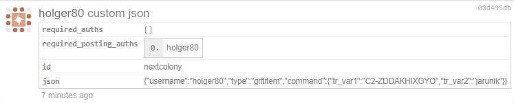

# UID

A UID is a unique id for blockchain items to allow tracability with ease.

## Random UID Generation

As you may know, I'm part of the team working on [NextColony](https://nexctcolony.io), a true blockchain game on steem. A true blockchain game means for us, that our internal database can be deleted and we will be able to reconstruct the exact same game state as before by replaying all broadcasted custom_json and transfer operations. This does also mean that every broadcasted custom_json will be excepted, as long as it is valid (correct syntax, sufficient resources, dependencies were met,...).

In order to allow replay and to have random events, the steem blocks itself will be used to generate a seed for the random generator. Every uid for planets, items, ships and missions will be generated from random numbers that have been seeded by the transaction id of the broadcasted transfer/custom_json. Thus, in a replay, the same random numbers will be generated and as the trx-id and other block ids are not predictable, random events and generated uids are not predictable.

```
import random
import base36
import math
import hashlib

def generateSeed(block_trx, block_id, previous_id):
    seed = hashlib.md5((trx_id + block_id + previous_id).encode()).hexdigest()
    return seed

def generateUid(length):
    number = round((pow(36, length + 1) - random.random() * pow(36, length)))
    return base36.dumps(number).upper()

def set_seed(seed):
    random.seed(a=seed, version=2)

def get_random_range(start, end):
    return math.floor((random.random() * (end-start + 1)) + start)

def uid_from_seed(prefix):
    return prefix+generateUid(10)
```

## How does it work in practice?

We will buy a chest and will gift it. As each item has a uid, I will use the broadcasted transfer in order to predict the uid of the chest.


The trx-id for the purchase is `e8d4bf45ba82b16c75fb777d90f2520089bfa5aa` and the block-number is `32060228`. We will use this information to predict the uid of the item:

The prefix of the Huge Chest is C2.

```
from beem.block import Block
block = Block(32060228)
trx_id = "e8d4bf45ba82b16c75fb777d90f2520089bfa5aa"
prefix = "C2-"
seed = generateSeed(trx_id, block["block_id"], block["previous"])
set_seed(seed)
uid_item = uid_from_seed(prefix)
print(uid_item)
```

The result is:

`C2-ZDDAKHIXGYO`



The predicted uid is correct and equal to the uid the backend of nextcolony had calculated.

All used random events in NextColony are based on these functions.

## VOPS

When unexplored space is explored during a mission, a new planet can be found. As the explorer has first to flight to the destination, which takes some time, the random numbers will be generated when the explorer will arrive. In nextcolony, we are doing this by using virtual operations. When the explorer is send, a VOPS is written to the database with a block timestamp. The VOPS is then triggered by the first block which has a timestamp which is higher then the stored one. The `block_id` and the `previous` ids are then taken from the block which is triggered by the VOPS.

## Checking all found planets

With the following python script, it is possible to validate the 8 found planets. In order to check if a planet is valid, the transaction id of the explorespace custom_json and the block_num of the virtual explore operation is needed. When the explorespace mission is started, the distance to the goal is calculated and the arrival time is determined. This arrival time defines then the block number of the virtual explore operation.

```python
from beem.block import Block
import hashlib
import datetime
import random
from collections import OrderedDict

def set_seed(seed):
    random.seed(a=seed, version=2)

def get_is_empty_space():
    return random.random() >= 0.01

def get_was_planet_found(block_num, trx_id):
    block = Block(block_num)
    seed = hashlib.md5((trx_id + block["block_id"] + block["previous"]).encode()).hexdigest()
    set_seed(seed)
    found = not get_is_empty_space()
    return found

if __name__ == '__main__':

    planet_found_list = [OrderedDict([('id', 35),
              ('user', 'reggaemuffin'),
              ('date', datetime.datetime(2019, 4, 30, 13, 56, 33)),
              ('c_hor', 183),
              ('c_ver', -175),
              ('trx_id', 'ca7093442b53ea5186b4ebecb56570e27e68ed58'),
              ('block_num', 32498931),
              ('planet_id', 'P-ZT52Y2YAEOW')]),
 OrderedDict([('id', 81),
              ('user', 'mancer-sm-alt'),
              ('date', datetime.datetime(2019, 5, 1, 6, 50, 45)),
              ('c_hor', 91),
              ('c_ver', 267),
              ('trx_id', 'dcd914ae73de12a876b9c9688ae54d7574fc79fa'),
              ('block_num', 32519195),
              ('planet_id', 'P-ZIY07VLIZXC')]),
 OrderedDict([('id', 273),
              ('user', 'flauwy'),
              ('date', datetime.datetime(2019, 5, 2, 23, 6, 18)),
              ('c_hor', -227),
              ('c_ver', 209),
              ('trx_id', '29dcd2d88eba9aaa2f413e3a36fac83a69e72a33'),
              ('block_num', 32567483),
              ('planet_id', 'P-ZU1JXAEU4KW')]),
 OrderedDict([('id', 283),
              ('user', 'hanzappedfirst'),
              ('date', datetime.datetime(2019, 5, 3, 0, 56, 48)),
              ('c_hor', 78),
              ('c_ver', -198),
              ('trx_id', '3fddd68f03eedae6dd93970c9d15cc5ff6f0db01'),
              ('block_num', 32569691),
              ('planet_id', 'P-ZBPUNEE2NMO')]),
 OrderedDict([('id', 438),
              ('user', 'kissi'),
              ('date', datetime.datetime(2019, 5, 4, 5, 40, 51)),
              ('c_hor', -221),
              ('c_ver', 175),
              ('trx_id', 'c1f4e868160ca9160f28d426c2738429a8d7ee0e'),
              ('block_num', 32604121),
              ('planet_id', 'P-Z8LN8NEOGE8')]),
 OrderedDict([('id', 737),
              ('user', 'uraniumfuture'),
              ('date', datetime.datetime(2019, 5, 5, 18, 51, 15)),
              ('c_hor', -35),
              ('c_ver', -217),
              ('trx_id', 'b808dafaa97bf34f17fe7a71c20ed6ebb767d103'),
              ('block_num', 32648704),
              ('planet_id', 'P-ZCQ6XF6HTSW')]),
 OrderedDict([('id', 797),
              ('user', 'fantasycrypto'),
              ('date', datetime.datetime(2019, 5, 6, 0, 39, 13)),
              ('c_hor', -290),
              ('c_ver', -42),
              ('trx_id', '646c4548d666293e547d4ab0f19f5a1e38930c3a'),
              ('block_num', 32655660),
              ('planet_id', 'P-Z1L0K1F5PPS')]),
 OrderedDict([('id', 866),
              ('user', 'lordvader'),
              ('date', datetime.datetime(2019, 5, 6, 7, 28, 19)),
              ('c_hor', -289),
              ('c_ver', -167),
              ('trx_id', 'e03e7a66310f67b69e82714a071892dd144caf7c'),
              ('block_num', 32663837),
              ('planet_id', 'P-ZHYWH6QELGG')])]

    print("Found %d planets" % len(planet_found_list))
    print("| vops block num | custom_json trx_id | uid | valid |")
    print("| --- | --- | --- | --- |")
    for data in planet_found_list:
        found = get_was_planet_found(data["block_num"], data["trx_id"])
        print("| %d | %s | %s | %s |" % (data["block_num"], data["trx_id"], data["planet_id"], str(found)))
```

The result of the script is the following:

| vops block num | custom_json trx_id                       | uid           | valid |
| -------------- | ---------------------------------------- | ------------- | ----- |
| 32498931       | ca7093442b53ea5186b4ebecb56570e27e68ed58 | P-ZT52Y2YAEOW | True  |
| 32519195       | dcd914ae73de12a876b9c9688ae54d7574fc79fa | P-ZIY07VLIZXC | True  |
| 32567483       | 29dcd2d88eba9aaa2f413e3a36fac83a69e72a33 | P-ZU1JXAEU4KW | True  |
| 32569691       | 3fddd68f03eedae6dd93970c9d15cc5ff6f0db01 | P-ZBPUNEE2NMO | True  |
| 32604121       | c1f4e868160ca9160f28d426c2738429a8d7ee0e | P-Z8LN8NEOGE8 | True  |
| 32648704       | b808dafaa97bf34f17fe7a71c20ed6ebb767d103 | P-ZCQ6XF6HTSW | True  |
| 32655660       | 646c4548d666293e547d4ab0f19f5a1e38930c3a | P-Z1L0K1F5PPS | True  |
| 32663837       | e03e7a66310f67b69e82714a071892dd144caf7c | P-ZHYWH6QELGG | True  |


## Checking all found empty space coordinates

I did the same for all 930 found empty spaces with the following results:

```
Found 930 empty spaces
930 / 930 are valid
```

I used the slightly modified `get_empty_space_found` function:

```python
def get_empty_space_found(block_num, trx_id):
    block = Block(block_num)
    seed = hashlib.md5((trx_id + block["block_id"] + block["previous"]).encode()).hexdigest()     
    set_seed(seed)        
    notfound = get_is_empty_space()    
    return notfound
```

All eight planets and all 930 explored coordinates are valid. The distance to the start planet does not play a role, only the transaction id of the custom_json and the block_id and the previous id of the first block after the arrival time.
